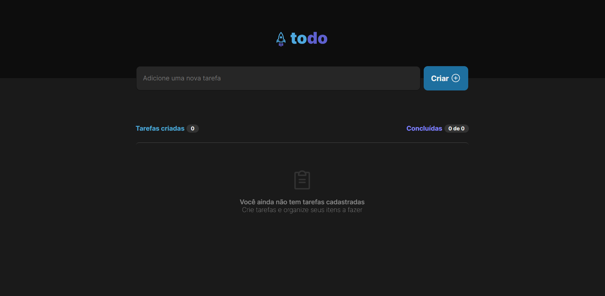

# 💻 Desafio 01 - Todo list



In this challenge, it was proposed to create a task list application to strengthen the React fundamentals that were trained in the Rocketseat React Trail. With this application you can create your own tasks to organize yourself during your daily life.

## 🚀 Features

- [x] Add Tasks: Users can add new tasks to their to-do list.

- [x] Delete Tasks: Users can delete tasks from their to-do list.

- [x] Mark Tasks as Complete: Users can mark tasks as completed or incomplete.

- [x] Persistent Storage: Tasks are saved in the browser's localStorage, so they persist even after a page refresh.


## 📲 Starting Project

1. Clone the repository:

   ```bash
   git clone https://github.com/AntoniofmBR/todo-list.git
   cd todo-list

2. Install dependencies:

    ```bash
    npm install

3. Start the server:

    ```bash
    npm run dev

## 👩‍💻 Usage

https://github.com/AntoniofmBR/todo-list/assets/122809149/da444266-b1a5-4546-aa2a-6aaaf4992873

